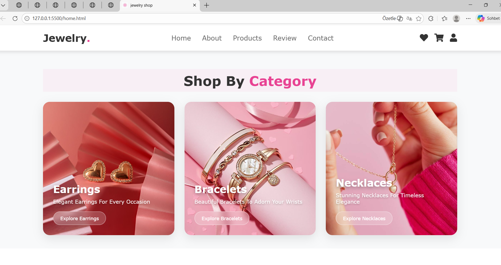
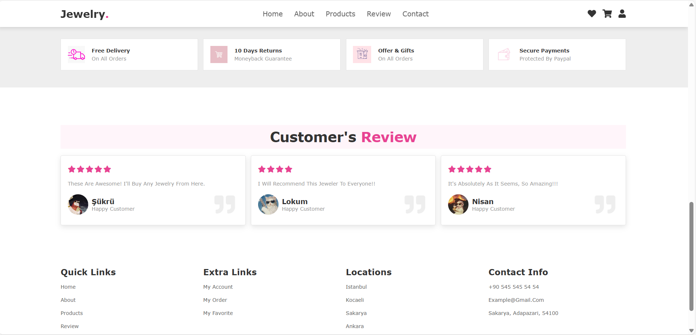
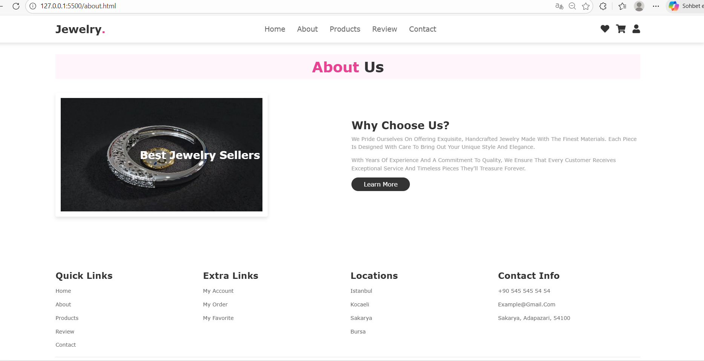
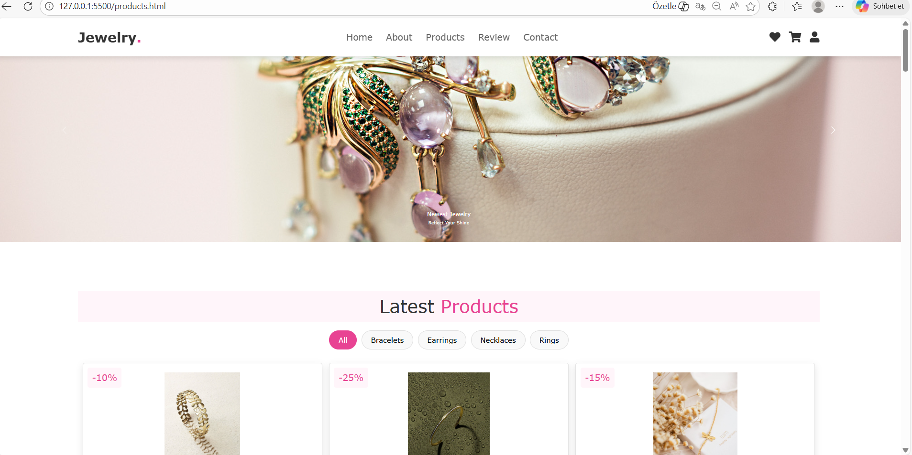
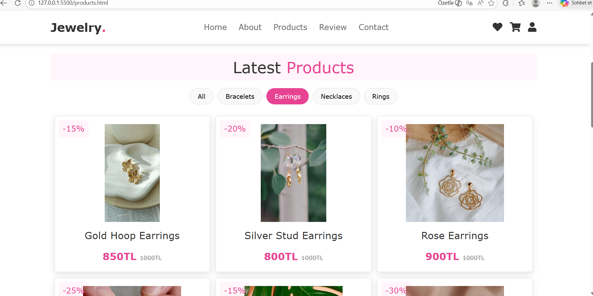
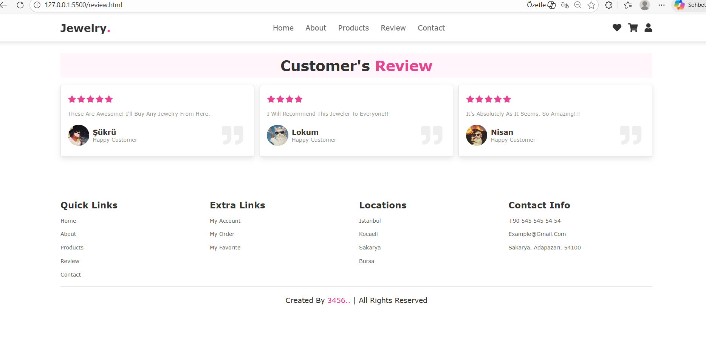
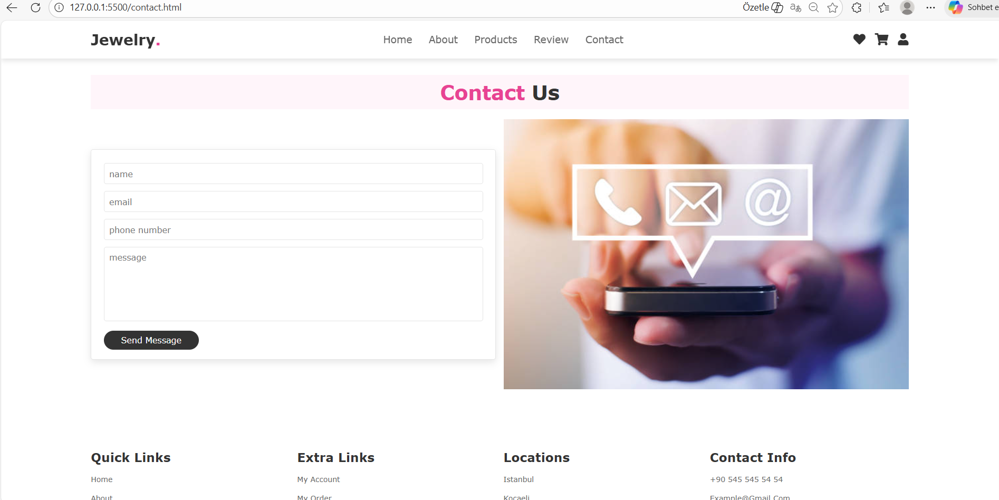

# Jewelry Shop Website

This project is a multi-page website representing a modern jewelry store. Developed with HTML, CSS and JavaScript, it has a user-friendly interface and interactive features.

## 📸 ScreenShots
## 📸 Screenshots

### 🏠 Home Page




### ℹ️ About Us


### 🛍️ Products



### 💬 Reviews


### 📞 Contact

## 🔍 PAGES

- `home.html`: Home, video, category cards and highlights

- `about.html`: About us video and company information
- `review.html`: Customer reviews
- `contact.html`: Contact form and location information
- `products.html`: Product list, filter, add to cart and select quantity features

## 💡 Notes about pages

- The cart system works on all pages and data is protected using `localStorage`.
- Special buttons and up/down icons are used for quantity selection.
- For images and videos to work correctly, file paths are assigned according to the fixed structure.

## 🛠️ Technologies Used

- **HTML**
- **CSS**
- **JavaScript**
- **Bootstrap 5** (for carousel)
- **Font Awesome** (for icons)

## ✨ Features

- Product filtering (category based)
- Adding and removing products to cart
- Cart modal (opens as a popup)
- Increase/decrease product quantity
- Responsive design (mobile/tablet compatible)
- FontAwesome icons
- Slider/Carousel with Bootstrap

## Accessibility Considerations
- High-contrast themes
- Alt text for images
- Keyboard navigability
**Uses principles of Universal Design:**
• Accessible without the need for adaptation
• Design benefits both users with and without disabilities


## 📂 File Structure

```
📁 project-folder/
├── home.html
├── about.html
├── products.html
├── review.html
├── contact.html
├── style.css
├── script.js
├── icons/...
├── products/... (product images)

```

## 🚀 Installation and Use

1. Download the project folder to your computer
2. Double-click `home.html` file and open it in the browser
3. You can access all pages by navigating the site

## Applying Design Principles

**Simplicity:**
- The UI uses simple, clear language (e.g., “Rings,” “Earrings” instead of jargon)
- Complex flows are broken into simple steps
**Structure:**
- Categories and filters follow a logical and domain-specific structure
- Users can easily locate items based on material, type, or price
**Consistency:**
- All product pages follow the same layout
- Reusable UI components ensure visual and functional consistency
**Tolerance:**
- Allows error recovery via “Undo” actions or back navigation

## Design Rationale
- Key design decisions are documented with justifications
- Ensures reusability, traceability, and future improvements
- Style guides and standards influence layout and interaction decisions

**Conclusion:**
--> The Jewelry website was designed using a user-centered design process involving direct user input, task analysis, and adherence to cognitive and usability principles. This approach ensures a usable, accessible, consistent, and enjoyable experience for a diverse user base.

## 👩‍💻 Developer

This project was developed by [3456].


## 🔍 Understanding Users and Gathering Requirements
💡
In this project, a user-centered design approach was adopted. During the design process, requirements were determined by the following methods:

### 👥 Direct Observation
Potential users' browsing habits on similar e-commerce sites were analyzed. Interactions such as which products they examined, filtering and basket usage were observed.

### 🗣️ Interviews
Conducted flexible interviews with 15 participants to understand expectations (e.g., “What features do you look for when buying jewelry online?”).

### 📋 Questionnaires/Surveys
Through a simple online survey, users' shopping habits and expectations from digital stores were collected. 

Key findings from 100 respondents: 
• Need for filtering options (ring, bracelet ect.)
• Desire for secure payment 
• Importance of real product images
• Preference for fast delivery and order tracking

### 👤 Identifying and Describing Users (Who Are the Users?)

- **Primary users:** Individuals shopping for jewelry for themselves (mainly women).
- **Secondary users:** Gift buyers (partners, friends, family).
- **Age:** 18–45
- **Gender:** Primarily female, but inclusive to all
- **IT Experience:** Familiar with web and mobile shopping, but not necessarily tech-savvy
- **Physical limitations:** High-contrast text and large buttons were designed for users with visual impairments.
- **Motivation:** Desire for aesthetic appeal, convenience, and trust in the website

### 🎯 User Goals, Tasks, and Use Cases

- To find and purchase a piece of jewelry that matches personal style or fulfills a gifting purpose. 
- Comparing products (category filter) and reading reviews before shopping
- Adding and organizing products to cart
- Communicating or getting support

#### 🔄 Task Analysis

**Task Scenario:** “Ayse wants to buy a silver necklace for her mother. She logs into the Jewelry website, selects the 'Necklace' category, views item details, adds a product to the cart.”

**Concrete Use Case:**
- Actor: User
- Goal: Purchase an item
**Tasks:**
• Browse products
• Apply category filters
• View product details
• Add to cart

### ✅ Requirements Gathering

**Principles of Perceptual Psychology:**
- Buttons and colors were used to attract the attention of users.
- Meaningful category distinctions were made by visual grouping.
- Familiar icons and labels were used to make the products memorable.
- Minimalist design was preferred to reduce the load on the interface.

**Experience-Based Principles (Norman’s Principles):**
- **Visibility:** Buttons like “Add to Cart” and “Checkout” are clearly visible(using eye-catching colors like pink).
- **Affordance:** The buttons are designed to be visually clickable.
- **Feedback:** A warning message was shown to the user after adding to cart.
